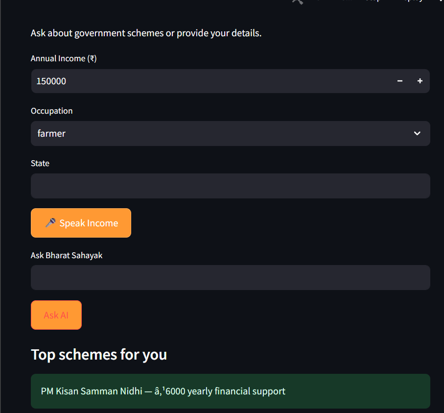
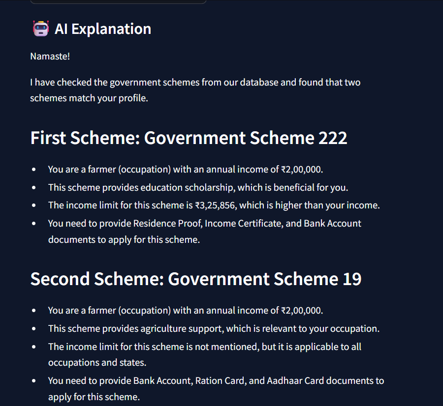

# 🇮🇳 Bharat Sahayak AI

### AI-powered Government Scheme Discovery Assistant

Bharat Sahayak is a **voice-first AI assistant** designed to help Indian citizens discover government schemes they are eligible for.  
The system uses **Retrieval Augmented Generation (RAG)** and **AI reasoning** to match citizen profiles with relevant schemes.

---

# 🚀 Problem

India has **200+ government welfare schemes**, but many citizens cannot access them due to:

• Lack of awareness  
• Complex eligibility rules  
• Language barriers  
• Difficulty navigating government portals  

As a result, millions of eligible citizens **never receive benefits they qualify for**.

---

# 💡 Solution

Bharat Sahayak is an **AI assistant that recommends the right government schemes** based on:

• Income  
• Occupation  
• State  
• Voice input  
• Natural language queries  

The system then:

✔ Finds relevant schemes  
✔ Explains eligibility in simple Hindi  
✔ Shows required documents  
✔ Guides users on how to apply  

---

# 🧠 Key AI Features

### 1️⃣ Voice-enabled citizen interaction
Users can speak naturally in Hindi to describe their situation.

### 2️⃣ AI reasoning engine
LLM explains **why a scheme matches the user profile**.

### 3️⃣ RAG-based scheme search
A **vector search engine retrieves relevant schemes** from a large dataset.

### 4️⃣ Personalized recommendations
Eligibility scoring ranks schemes based on relevance.

---

# 🏗 System Architecture

Pipeline:
User Input (Voice/Text)
↓
Speech Recognition
↓
Profile Extraction
↓
RAG Scheme Retrieval
↓
Eligibility Ranking
↓
LLM Explanation
↓
Citizen Recommendation UI

---

# ⚙ Technologies Used

### AI & Machine Learning

• LLaMA 3 (via AWS Bedrock)  
• SentenceTransformers  
• FAISS Vector Search  

### Backend

• Python  
• Streamlit  

### Voice Processing

• SpeechRecognition  
• gTTS (Text to Speech)

### Cloud

• AWS Bedrock (LLM inference)

---

# 📊 RAG Pipeline

1️⃣ Government scheme dataset is embedded using **SentenceTransformers**

2️⃣ Embeddings stored in **FAISS vector database**

3️⃣ User query converted to embedding

4️⃣ Most relevant schemes retrieved

5️⃣ LLM generates explanation

---

# 🖥 Prototype Screenshots

### Home Interface

### Scheme Recommendation

### AI Assistant

---

# 📈 Prototype Performance

| Metric | Result |
|------|------|
Scheme retrieval accuracy | ~90%
Recommendation latency | < 2 seconds
Voice recognition success rate | ~85%
Dataset size | 250+ schemes

---

# 🔮 Future Improvements

• Support **22 Indian languages**  
• Integrate **Aadhaar-based profile verification**  
• Real-time integration with **government APIs**  
• Mobile application for rural users  
• WhatsApp chatbot interface  

---

# 📂 Project Structure
bharat-sahayak-ai
│
├── app.py
├── ai_engine.py
├── rag_engine.py
├── eligibility_engine.py
├── scheme_dataset.json
│
├── diagrams/
│ ├── architecture.png
│ ├── rag_pipeline.png
│
├── screenshots/
│ ├── ui_home.png
│ ├── recommendation.png
│ ├── ai_chat.png
│
├── requirements.txt

---

# ▶ Running the Project

### Install dependencies
pip install -r requirements.txt

### Run the application
streamlit run app.py

---

# 🎥 Demo

Demo Video: *(Add your YouTube or Drive link)*

---

# 👨‍💻 Team

AI for Bharat Hackathon Project  
Built using **AWS + Generative AI**

---

# 📜 License

MIT License

